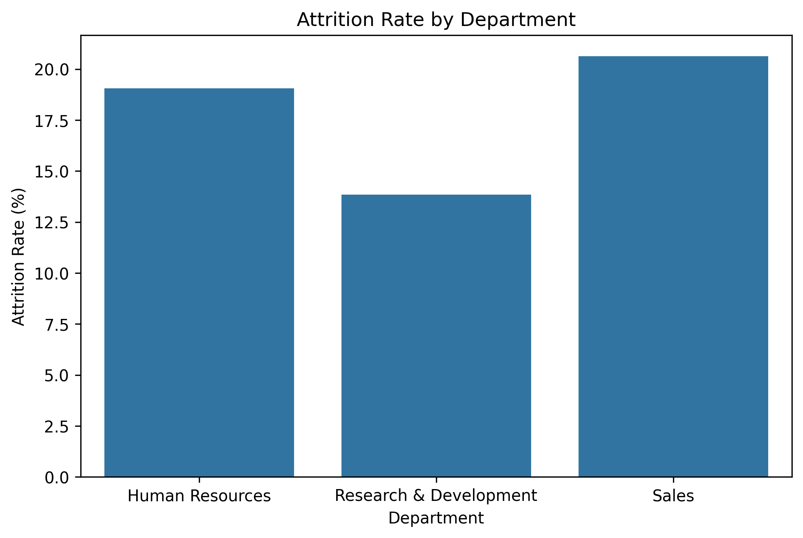
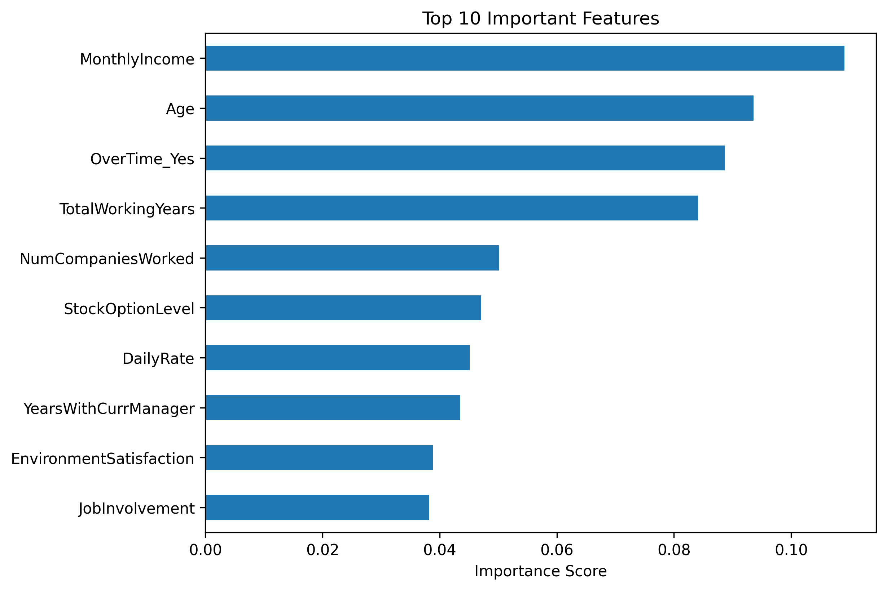
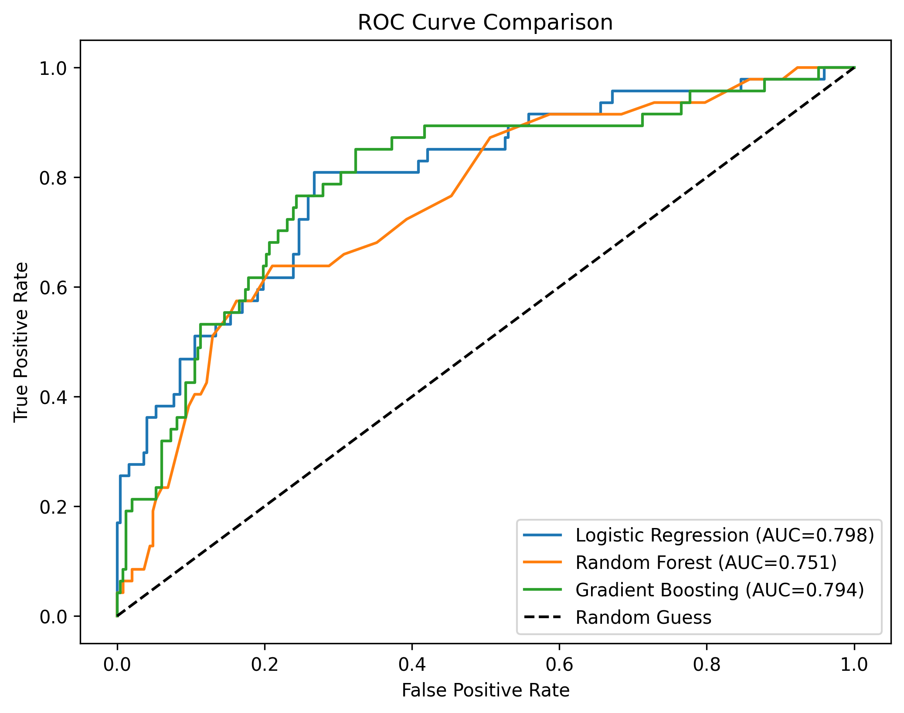

# 👨‍💼 Employee Attrition Prediction using Machine Learning

A Machine Learning project that predicts whether an employee is likely to leave an organization based on HR-related factors such as salary, work-life balance, overtime, job role, years at the company, and other employee attributes.

The project demonstrates an end-to-end machine learning workflow, from data preprocessing and exploratory data analysis to model building, evaluation, and business recommendations.

---

## 📌 Project Overview

Employee attrition is one of the biggest challenges faced by organizations. Losing experienced employees results in increased recruitment costs, additional training expenses, and reduced productivity.

This project aims to build a predictive machine learning model that helps HR teams identify employees who may be at risk of leaving, enabling proactive retention strategies and informed decision-making.

---

## 🎯 Problem Statement

Build a classification model capable of predicting whether an employee is likely to leave the company using historical HR data.

The project includes:

- Data Cleaning & Preprocessing
- Exploratory Data Analysis (EDA)
- Feature Engineering
- Model Training
- Model Evaluation
- Business Insights & HR Recommendations

---

## 📂 Dataset

**Dataset:** IBM HR Analytics Employee Attrition Dataset

- 📊 Total Employees: **1470**
- 📑 Features: **35**
- 🎯 Target Variable: **Attrition (Yes / No)**

Dataset Source:
https://www.kaggle.com/datasets/pavansubhasht/ibm-hr-analytics-attrition-dataset

---

## 🛠️ Technologies Used

| Category | Tools |
|----------|-------|
| Language | Python |
| Notebook | Google Colab / Jupyter Notebook |
| Data Analysis | Pandas, NumPy |
| Visualization | Matplotlib, Seaborn |
| Machine Learning | Scikit-learn |
| Version Control | Git & GitHub |

---

## 🔄 Machine Learning Workflow

```
Dataset
    │
    ▼
Data Cleaning
    │
    ▼
Exploratory Data Analysis
    │
    ▼
Feature Engineering
    │
    ▼
Train-Test Split
    │
    ▼
Model Training
    │
    ▼
Model Evaluation
    │
    ▼
Feature Importance
    │
    ▼
Business Recommendations
```

---

## 🤖 Machine Learning Models

The following classification algorithms were trained and compared:

- ✅ Logistic Regression
- 🌳 Random Forest Classifier
- 🚀 Gradient Boosting Classifier

---

## 📊 Evaluation Metrics

Models were evaluated using:

- Precision
- Recall
- F1 Score
- ROC-AUC Score
- Confusion Matrix

---

## 📈 Exploratory Data Analysis

The analysis focused on understanding the factors affecting employee attrition.

Some of the visualizations include:

-  Attrition Rate by Department
-  Attrition Rate by Job Role
-  Monthly Income vs Attrition
-  Work-Life Balance vs Attrition
-  Years at Company vs Attrition
-  Confusion Matrix
-  Top Feature Importance
-  ROC Curve Comparison

---

## 💡 Key Business Insights

- 📌 The **Sales department** recorded the highest employee attrition rate.
- 📌 **Sales Representatives** experienced the highest turnover among all job roles.
- 📌 Employees with **lower monthly income** showed a higher tendency to leave.
- 📌 **Overtime** significantly increased the likelihood of employee attrition.
- 📌 Poor **Work-Life Balance** was associated with increased employee turnover.
- 📌 Most employees who left the company did so during their early years of employment.

---

## ⭐ Top Factors Influencing Attrition

The most important features identified by the model include:

1. Monthly Income
2. Age
3. Overtime
4. Total Working Years
5. Number of Companies Worked
6. Stock Option Level
7. Daily Rate
8. Years with Current Manager
9. Environment Satisfaction
10. Job Involvement

---

## 📷 Sample Visualizations

### 📌 Attrition by Department



---

### 📌 Top Feature Importance



---

### 📌 ROC Curve Comparison



---

## 📁 Project Structure

```
EmployeeAttrition/
│
├── analysis.ipynb
├── summary.pdf
├── README.md
├── WA_Fn-UseC_-HR-Employee-Attrition.csv
│
└── charts/
    ├── chart1_department_attrition.png
    ├── chart2_jobrole_attrition.png
    ├── chart3_income_boxplot.png
    ├── chart4_worklife_attrition.png
    ├── chart5_years_attrition.png
    ├── chart6_confusion_matrix.png
    ├── chart7_feature_importance.png
    └── chart8_roc_curve.png
```

---

## 🎯 Results

Three machine learning models were trained and evaluated.

- Logistic Regression achieved the best balance for identifying employees likely to leave.
- Gradient Boosting provided valuable feature importance analysis.
- The project successfully demonstrates how machine learning can support HR teams in reducing employee attrition through data-driven decision-making.

---

## 🚀 Future Improvements

Some possible enhancements include:

- Hyperparameter tuning using GridSearchCV
- Handling class imbalance using SMOTE
- Deploying the model using Streamlit or Flask
- Real-time employee attrition prediction dashboard
- Explainable AI using SHAP values


---
